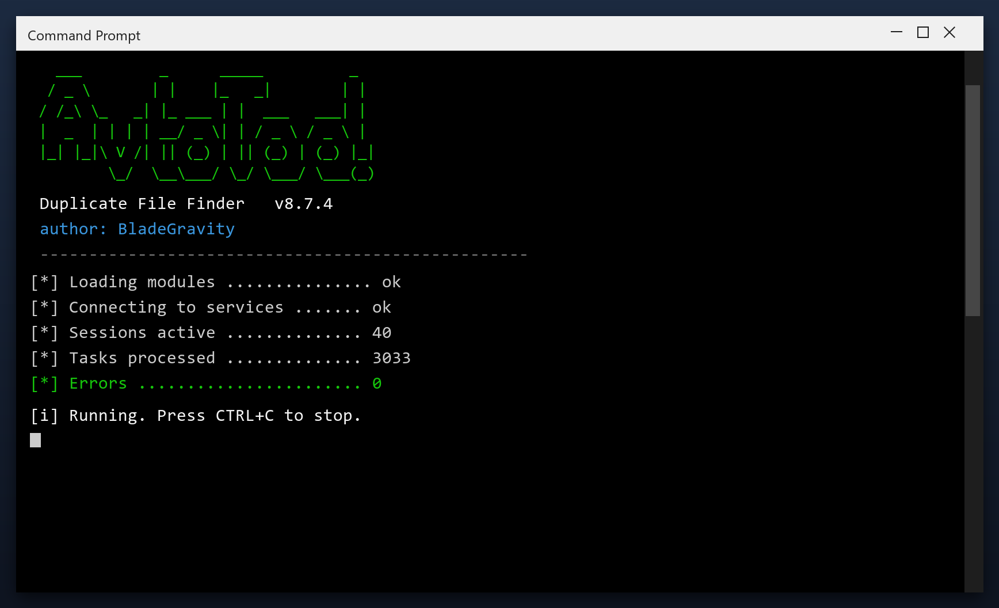

# Duplicate File Finder: Free Download and Guide (2026)

 

Duplicate file finder is a lightweight Windows program for maintaining your system. It runs offline, uses very little memory and does not slow your computer down. **Completely free.**

  

  

## Questions & Answers

**Is duplicate file finder free?**

Yes - the full version, no registration and no hidden payments.

**Is it safe?**

The build is scanned and tested. It creates a restore point before making changes.

**Does it work on Windows 11?**

Yes, and on Windows 10 (64-bit).

**Will it delete my files?**

No. It only removes temporary and leftover files, not your documents or photos.

**Do I need the internet?**

Only to download it. After that it works offline.

**Where do I download it?**

Use the green button in the Quick Start section above.

## What Is It

Duplicate file finder is a small Windows tool for routine maintenance. You do not need to understand the technical details - it reports what it found in plain language and only changes things after you agree. Nothing runs in the background and nothing phones home.

| **Term** | **Meaning** |
| --- | --- |
| **Plain language** | No technical jargon |
| **Report** | A summary of what was found |
| **Confirm** | You approve before changes |
| **No telemetry** | Nothing is sent anywhere |

## The Problem

- **Slow performance** - too many background programs start with Windows
- **Cluttered disk** - temporary files and leftovers build up over time
- **Registry errors** - broken entries cause errors and crashes
- **Hard to find settings** - Windows hides the useful options
- **Bundled junk** - many free tools install adware or toolbars

## The Fix

| **Problem** | **Solution** |
| --- | --- |
| **Slower every month** | Regular maintenance keeps it fast |
| **Slow shutdown** | Clear stuck background tasks |
| **High idle memory** | Trim memory-hungry apps |
| **Registry bloat** | Remove thousands of dead entries |
| **Messy files** | Find and remove duplicates |

## Step by Step

1. **Grab the file** using the green button
2. **Extract** it to a folder of your choice
3. **Run** the tool (as admin for full access)
4. **Read** the scan report
5. **Apply** the fixes and reboot

> **Note:** if nothing happens when you click, run the file as administrator. Windows sometimes blocks new programs until you allow them.

## Features

| **Feature** | **Details** |
| --- | --- |
| **Interface** | Single window, no clutter |
| **Learning curve** | None - obvious buttons |
| **Languages** | English |
| **Permissions** | Admin for some tasks |
| **Conflicts** | None with other tools |
| **Uninstall** | Clean, leaves nothing behind |

## Requirements

| **Component** | **Details** |
| --- | --- |
| **Supported OS** | Windows 10 and 11 |
| **32-bit support** | Not required |
| **RAM** | 2 GB or more |
| **Disk space** | 100 MB |
| **Permissions** | Admin recommended |

## What You Get

| **Component** | **Details** |
| --- | --- |
| **Executable** | The tool itself |
| **Config** | Defaults already set |
| **Guide** | Plain-language walkthrough |
| **Support** | Issues section in this repo |

## Tips

- Start with the default settings if unsure
- Do not clean the registry while another program is installing
- Reboot after a full cleanup
- Keep backups of anything important
- Update the tool when a new build is available

## Troubleshooting

| **Issue** | **Fix** |
| --- | --- |
| **High CPU during scan** | Expected - it throttles when you use the PC |
| **Antivirus blocks cleanup** | Add an exclusion for the tool |
| **Cleanup leaves temp files** | Some are locked - reboot and rescan |
| **Tool asks for admin** | Approve it so it can clean system areas |

## Summary

**Duplicate file finder** keeps your Windows PC clean and fast in 2026. One scan finds junk files and errors, and one click fixes them safely.

**What you get:**

- A fast, low-memory Windows tool
- Safe cleanup with a restore point
- Plain, easy settings
- Free, no registration

**Download duplicate file finder today - it is free.**

---

*glossy-pixel-658 · Updated 2026-10-10 · Shared under the MIT License*
